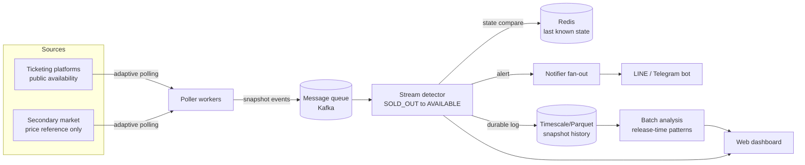

# Architecture

Ticket Radar is an event-driven pipeline that watches public ticket availability
and pushes an alert the instant a sold-out section is re-released on the **official**
platform (refunds, payment-timeout releases, added blocks).

## Two deployment modes

| Concern        | Simple mode (this repo's default) | Scalable mode |
|----------------|-----------------------------------|---------------|
| Queue          | direct function call (sink)       | Kafka topic `snapshots`, partitioned by `event_id` |
| Last state     | SQLite `last_state`               | Redis |
| Snapshot log   | SQLite `snapshots`                | TimescaleDB hypertable / Parquet on object storage |
| Stream compute | in-process `StreamDetector`       | Kafka consumer group / Spark Structured Streaming / Flink |
| Notify         | console / Telegram                | notifier service, fan-out per subscriber |

The seam between the two is the **sink**: the poller just calls `sink(snapshot)`.
In simple mode the sink is `detector.process`; in scalable mode it is
`producer.send("snapshots", ...)` and the detector becomes a consumer.

## Why these choices fit the data

* **Stream processing** — the product is "tell me the moment state flips", which is
  an edge-detection problem over a stream, not a batch query.
* **Message queue** — decouples bursty polling from detection and lets both scale
  horizontally; partitioning by `event_id` keeps each section's order intact.
* **Redis for state** — the hot path only needs the last status per section: an
  O(1) key lookup, not a relational query.
* **Timescale/Parquet for history** — append-heavy time-series feeding the batch
  job that mines release-timing patterns (the differentiated insight).

## Scaling to 10x / 100x

More events simply means more poller workers (containerised, one consumer group)
and more Kafka partitions; detection and notification fan-out scale independently.
The real ceiling is **not compute** but how hard we can politely poll a platform
before being rate-limited — which is a product and ethics constraint, not a
capacity one.
